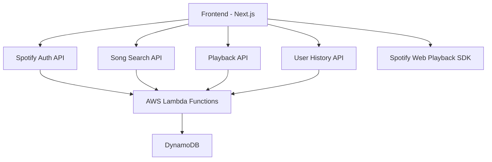
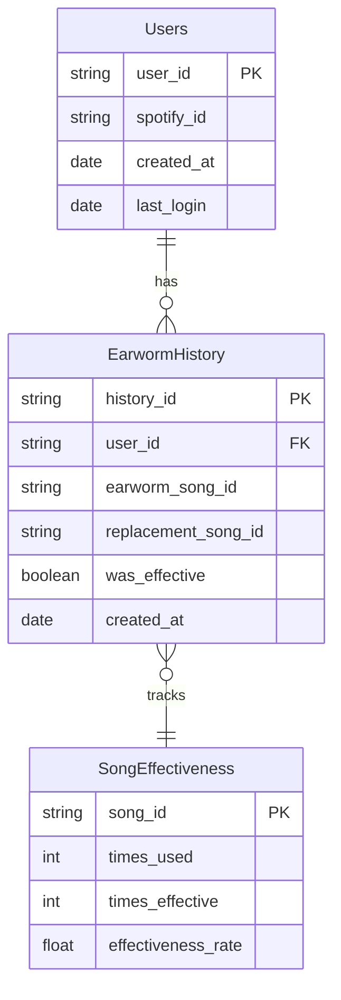
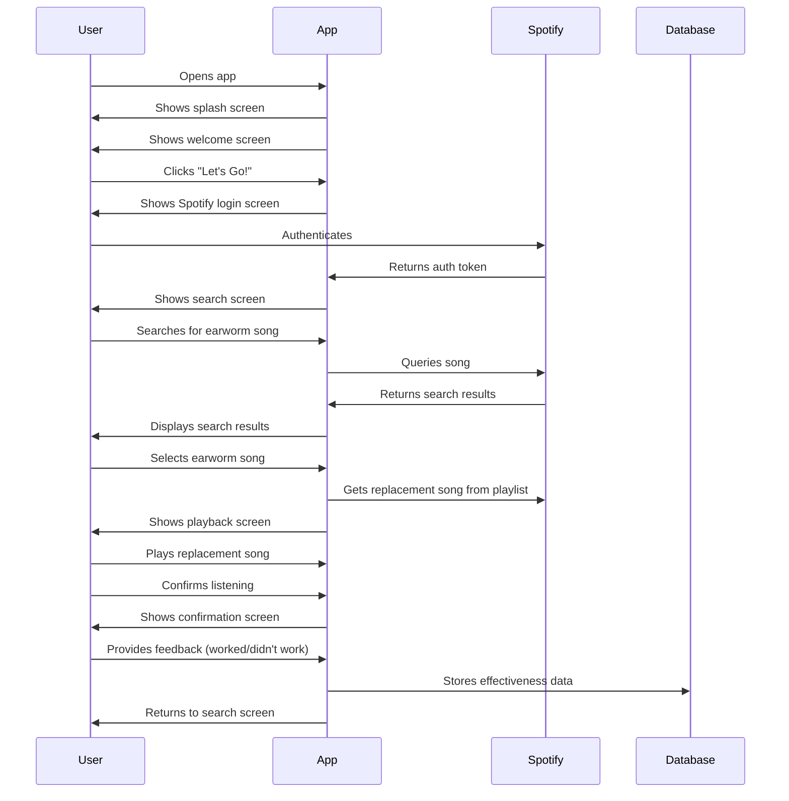
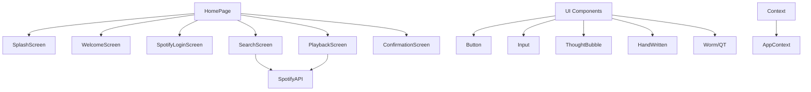

# DeWorm App Implementation Plan

Based on a review of the project documentation and reference implementation, this document outlines a comprehensive implementation plan for the DeWorm app - a charming mobile-first application that helps users cure earworms by playing replacement songs from a curated Spotify playlist, all guided by the mascot "QT".

## Architecture Overview

## Implementation Phases

### Phase 1: Core App Structure & UI

1. Set up Next.js project with proper configuration
2. Implement hand-drawn UI components following the reference implementation
3. Create responsive layouts for all screens in the user flow
4. Implement animations and transitions

### Phase 2: Spotify Integration

1. Set up Spotify developer account and application
2. Implement authentication flow with Spotify API
3. Integrate Spotify Web Playback SDK for song playback
4. Implement song search functionality

### Phase 3: Backend & Database

1. Set up AWS Amplify project
2. Configure DynamoDB tables for:
   - User records
   - Earworm history
   - Replacement song effectiveness
3. Implement API routes for data storage and retrieval
4. Set up serverless functions for business logic

### Phase 4: Testing & Refinement

1. Write Jest unit tests for components and functions
2. Create Playwright E2E tests for user flows
3. Implement error handling and edge cases
4. Add analytics tracking

### Phase 5: Deployment & Optimization

1. Configure CI/CD with GitHub Actions
2. Set up AWS Amplify hosting
3. Configure domain (deworm.us)
4. Performance optimization
5. Implement legal requirements (privacy policy, cookie consent)

## Technical Considerations

### Data Model

### Spotify Integration Details

The app will use the Spotify Web Playback SDK as specified, avoiding the deprecated preview functionality. This requires:

1. Implementing proper authentication scopes:

   - `streaming`
   - `user-read-email`
   - `user-read-private`
   - `user-read-playback-state`
   - `user-modify-playback-state`

2. Creating a Web Playback instance when the user is authenticated
3. Managing playback transfers between devices

### Hand-drawn UI Implementation

The UI will use techniques from handdrawn.css with Tailwind utility classes to create:

- Squiggly borders
- Hand-written text styles
- Playful button and input styles
- Animated elements with bounce and wiggle effects

## User Flow

## Component Structure

## Key Features to Implement

1. **Spotify Authentication**

   - Implement OAuth flow
   - Store tokens securely
   - Handle token refresh

2. **Song Search**

   - Real-time search with Spotify API
   - Display album art and artist information
   - Handle search errors gracefully

3. **Playback**

   - Initialize Spotify Web Playback SDK
   - Control playback (play, pause)
   - Display playback progress
   - Handle playback errors

4. **User History**

   - Track earworm and replacement songs
   - Store effectiveness data
   - Avoid repeating ineffective replacements

5. **Analytics**
   - Track most common earworms
   - Measure replacement effectiveness
   - Monitor user engagement

## Implementation Decisions

Based on project requirements and planning discussions, the following implementation decisions have been made:

### Song Selection

- Replacement songs will be played exclusively from the specified Spotify playlist: https://open.spotify.com/playlist/0E9WYGYWZBqfmp6eJ0Nl1t
- Any new earworm songs that users report will be added to this playlist for future use

### Effectiveness Tracking

- A simple yes/no response system will be used to track the effectiveness of replacement songs
- This data will be stored to improve future recommendations

### Database

- A simple database interface will be implemented using Amazon DynamoDB
- The database will track user history, earworm frequency, and replacement song effectiveness

### Authentication

- Spotify OAuth will be used exclusively for authentication (no separate user creation)
- The architecture will be designed to support Apple Music integration in the future

### User Interface

- The existing mascot SVG (public/images/mascot.svg) will be used throughout the app
- Standard cookie consent mechanisms will be implemented to comply with privacy regulations
- The UI will follow the hand-drawn aesthetic specified in the design requirements

### Technical Notes

- Ensure all code is compatible with Next.js 15.2.3
- Use the Spotify Web Playback SDK instead of the deprecated preview functionality
- Implement proper callback URLs for Spotify authentication
